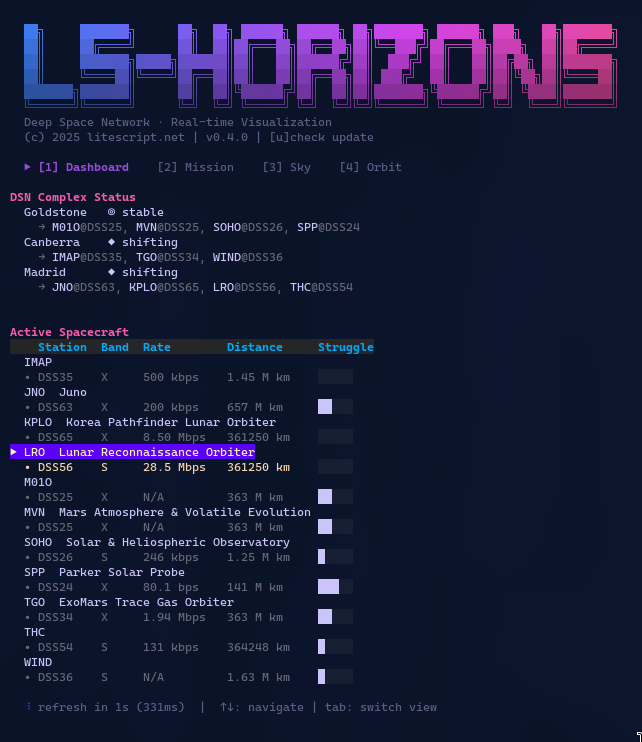
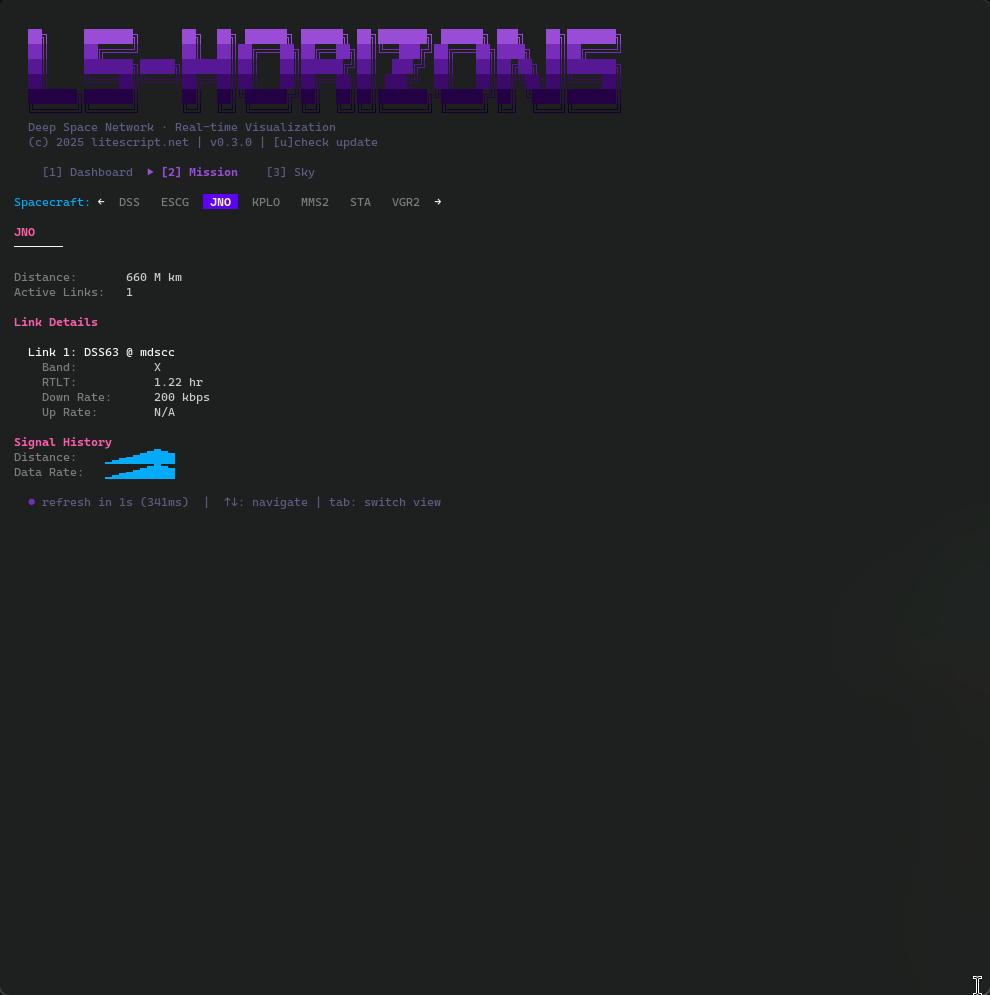
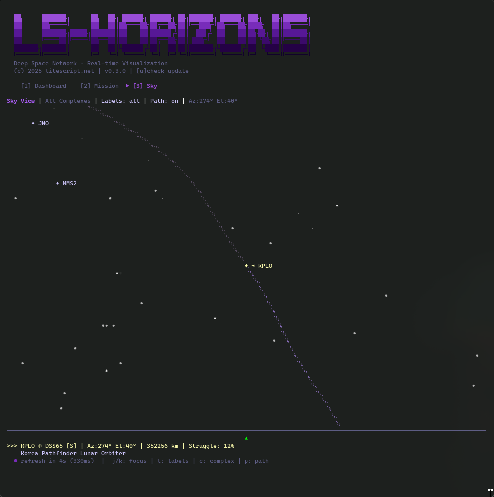
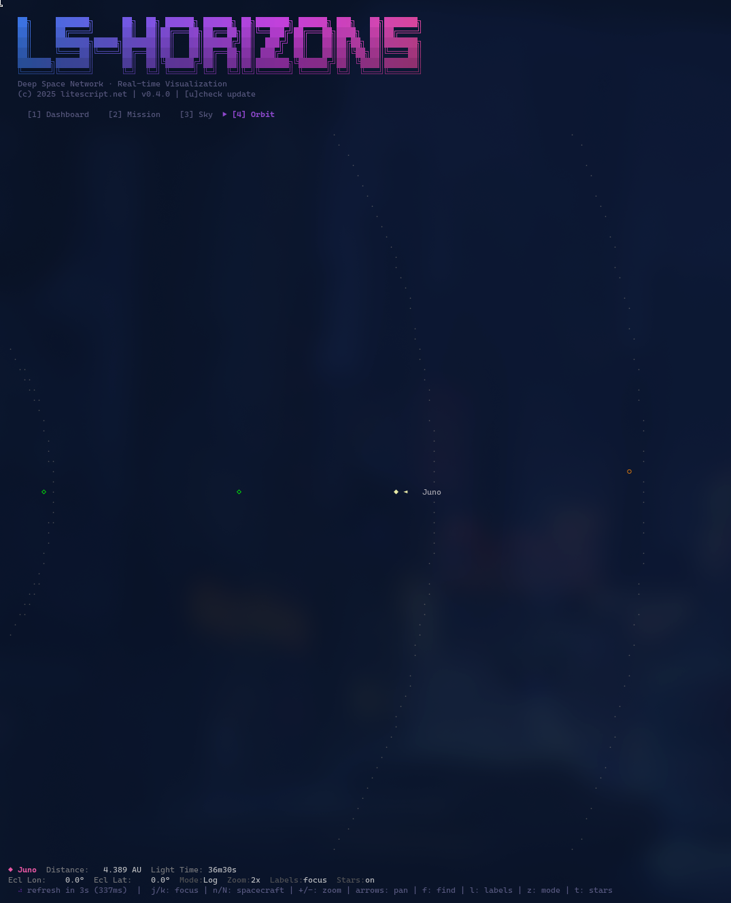

# ls-horizons

A terminal UI for visualizing NASA's Deep Space Network in real-time.



## Features

- **Real-time DSN monitoring** — Live data from NASA's Deep Space Network XML feed
- **Pass planning** — Computed visibility windows for all three DSN complexes using JPL Horizons ephemeris
- **Real star catalog** — 150+ bright stars with accurate J2000 coordinates rendered in the sky view
- **Astronomical projection** — Proper RA/Dec to Az/El conversion using GMST/LST calculations
- **JPL Horizons integration** — Trajectory path arcs and geocentric RA/Dec for pass planning
- **Four view modes**:
  - **Dashboard** — Complex status and active spacecraft table with multi-antenna tracking
  - **Mission Detail** — Per-spacecraft deep dive with pass schedules and link details
  - **Sky View** — Animated star field with spacecraft positions and smooth camera transitions
  - **Orbit View** — Solar system visualization with real planet positions and spacecraft trajectories
- **Derived metrics**:
  - Distance calculated from round-trip light time (RTLT)
  - Velocity estimation from RTLT delta
  - "Struggle index" — composite difficulty metric based on distance, data rate, and elevation
- **Event detection** — Tracks link handoffs between complexes, new acquisitions, and signal losses
- **Headless mode** — JSON export and text summaries for scripting and monitoring

## Screenshots

### Dashboard View
Real-time status of all three DSN complexes with active spacecraft table showing antennas, bands, data rates, distances, and struggle indicators.


### Mission Detail View
Deep dive into individual spacecraft with link details, pass schedules for all three DSN complexes, and signal metrics. Press `Enter` from Dashboard to jump directly here.



### Sky View
Animated celestial view with real star positions, spacecraft locations, and trajectory path arcs. Smooth camera transitions when cycling between spacecraft.



### Orbit View
Solar system visualization showing planets at real positions (via JPL Horizons) and active spacecraft with their trajectories. Toggle star background with `t`.



## Installation

### From source

Requires Go 1.21+

```bash
go install github.com/litescript/ls-horizons/cmd/ls-horizons@latest
```

### Build locally

```bash
git clone https://github.com/litescript/ls-horizons.git
cd ls-horizons
go build -o ls-horizons ./cmd/ls-horizons
```

## Usage

### Interactive TUI

```bash
# Launch with default 5-second refresh
ls-horizons

# Custom refresh interval
ls-horizons --refresh 30s

# Use specific ephemeris source
ls-horizons --ephem horizons   # JPL Horizons (default)
ls-horizons --ephem dsn        # DSN-derived only
ls-horizons --ephem auto       # Horizons with fallback
```

**Keybindings:**

| Key | Action |
|-----|--------|
| `1` or `d` | Dashboard view |
| `2` or `m` | Mission detail view |
| `3` or `s` | Sky view |
| `4` or `o` | Orbit view |
| `Tab` | Cycle through views |
| `Enter` | Open Mission view for selected spacecraft (Dashboard) |
| `j/k` or `↑/↓` | Navigate lists |
| `[/]` or `←/→` | Cycle spacecraft (Mission/Sky/Orbit) |
| `h` | Toggle pass panel (Mission view) |
| `l` | Toggle labels (Sky view) |
| `c` | Cycle complex filter (Sky view) |
| `p` | Toggle trajectory path (Sky view) |
| `t` | Toggle star background (Orbit view) |
| `u` | Check for updates |
| `q` | Quit |

### Headless Mode

```bash
# Print summary table once
ls-horizons --summary

# Summary with ASCII mini sky view
ls-horizons --summary --mini-sky

# Watch mode: refresh every 30 seconds
ls-horizons --summary --watch 30s

# Single-line "now playing" mode
ls-horizons --now

# Show card for specific spacecraft
ls-horizons --sc VGR1

# Show only changes between fetches
ls-horizons --diff --watch 30s

# Beep on important events (TTY only)
ls-horizons --summary --watch 30s --beep

# Show event log
ls-horizons --events

# Export JSON snapshot to file
ls-horizons --snapshot-path snapshot.json

# Export JSON to stdout (for piping)
ls-horizons --snapshot-path -
```

### All Flags

| Flag | Default | Description |
|------|---------|-------------|
| `--refresh` | `5s` | Data refresh interval (1s - 5m) |
| `--ephem` | `auto` | Ephemeris source: `horizons`, `dsn`, or `auto` |
| `--summary` | `false` | Print text summary instead of TUI |
| `--mini-sky` | `false` | Show ASCII mini sky view |
| `--now` | `false` | Single-line now-playing mode |
| `--sc` | `""` | Show card for specific spacecraft |
| `--diff` | `false` | Show only changes between fetches |
| `--beep` | `false` | Beep on important events (TTY only) |
| `--events` | `false` | Show event log |
| `--watch` | `0` | Repeat output at interval |
| `--snapshot-path` | `""` | Export JSON to file (`-` for stdout) |
| `--log-level` | `info` | Log level (debug, info, warn, error) |

## Data Sources

### NASA Deep Space Network

Live telemetry data from NASA's publicly available DSN feed:

```
https://eyes.nasa.gov/dsn/data/dsn.xml
```

The DSN consists of three antenna complexes positioned roughly 120° apart around Earth:
- **Goldstone** (GDSCC) — Mojave Desert, California, USA
- **Canberra** (CDSCC) — Tidbinbilla, Australia
- **Madrid** (MDSCC) — Robledo de Chavela, Spain

This positioning ensures continuous coverage for deep space missions as Earth rotates.

### JPL Horizons

Spacecraft trajectory data from NASA/JPL's Horizons system:

```
https://ssd.jpl.nasa.gov/api/horizons.api
```

Used for computing accurate sky positions and trajectory path arcs. Supports 35+ spacecraft with NAIF SPICE ID mappings including Voyager 1/2, JWST, Mars rovers, Juno, New Horizons, and more.

### Yale Bright Star Catalog

Star positions sourced from the Yale Bright Star Catalog and IAU star names. The sky view renders 150+ stars down to magnitude ~4.5, with brightness-based rendering (brighter stars get larger glyphs).

## Architecture

```
cmd/ls-horizons/        Entry point and CLI flags
internal/
├── astro/              Astronomical calculations
│   ├── coords.go       RA/Dec ↔ Az/El transforms, GMST/LST
│   ├── frames.go       Coordinate frame conversions (ecliptic, etc.)
│   ├── visibility.go   Ground station visibility calculations
│   ├── sun.go          Sun position calculations
│   └── stars.go        Star catalog with 150+ bright stars
├── dsn/
│   ├── models.go       Data structures (Station, Antenna, Link, etc.)
│   ├── parser.go       XML feed parsing
│   ├── fetcher.go      HTTP client with retry logic
│   ├── derive.go       Distance, velocity, struggle index
│   ├── passplan.go     Pass planning with elevation thresholds
│   ├── spacecraft.go   Spacecraft catalog with mission metadata
│   ├── spacecraft_view.go  Multi-antenna tracking abstraction
│   ├── solarsystem.go  Solar system cache with planet positions
│   ├── observer.go     DSN complex observer locations
│   └── export.go       JSON and text export
├── ephem/              Ephemeris providers
│   ├── provider.go     EphemerisProvider interface
│   ├── horizons.go     JPL Horizons API client (ephemeris + RA/Dec)
│   ├── dsn_provider.go DSN-derived fallback
│   └── targets.go      NAIF SPICE ID mappings (45+ spacecraft)
├── state/
│   └── state.go        Thread-safe state with pass plan caching
├── ui/
│   ├── ui.go           Bubble Tea main model with request queue
│   ├── dashboard.go    Dashboard view with Enter→Mission flow
│   ├── mission_detail.go  Mission view with pass panel
│   ├── sky_view.go     Sky projection with braille arc rendering
│   └── solarsystem_view.go  Orbit view with ecliptic projection
├── logging/
│   └── logging.go      Structured logging
└── version/
    └── version.go      Version and update checking
```

## Why "ls-horizons"?

A play on the Unix `ls` command — this tool lets you "list" what's happening at the horizons of our solar system. Also a nod to NASA's New Horizons mission to Pluto and beyond.

## Contributing

Contributions welcome! Please:

1. Fork the repository
2. Create a feature branch
3. Run tests: `go test ./...` and `go vet ./...`
4. Submit a pull request

## License

MIT License — see [LICENSE](LICENSE) for details.

## Acknowledgments

- NASA/JPL for the public DSN data feed and Horizons ephemeris system
- Yale Bright Star Catalog for star position data
- [Bubble Tea](https://github.com/charmbracelet/bubbletea) for the excellent TUI framework
- [Lip Gloss](https://github.com/charmbracelet/lipgloss) for terminal styling
